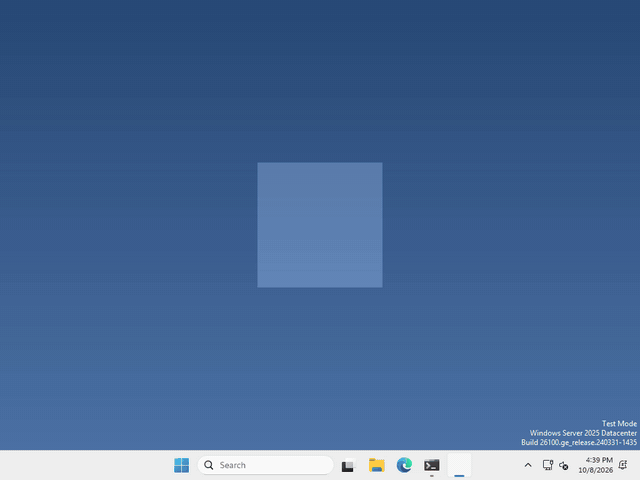

# Let's make our pet hop!

Pets are more fun when they move around when you poke them! In Godot, a `Tween` changes a property a little each frame, so it slides from one value to another.



I made mine hop when you click it, but not when you drag it, and what your pet does when it’s clicked is up to you.

## Make a Tween

A Tween isn’t a node, so there’s nothing to add in the Scene panel. We just make one in code.

whenever you want your pet to move, run

```gdscript
var tween = create_tween()
tween.tween_property($AnimatedSprite2D, "offset:y", -30.0, 0.15)
tween.tween_property($AnimatedSprite2D, "offset:y", 0.0, 0.15)
```

Each `tween_property` is one move: the thing to change, the property, where it should end up, and how many seconds it takes. They run one after the other, so this goes up 30 pixels and then back down. Hop!

`offset` moves the picture without moving the sprite itself, so the pet’s click area stays where it is.

## A click or a drag?

Pressing and letting go of the mouse is both a click and a drag. What’s different is how far the mouse moved in between, so if you want to tell them apart, compare where you pressed with where you let go.

That’s it!

## Want more?

A Tween can change almost any property, make it speed up or slow down smoothly, run moves at the same time, loop, and a lot more. It’s all in the [Tween docs](https://docs.godotengine.org/en/stable/classes/class_tween.html).
