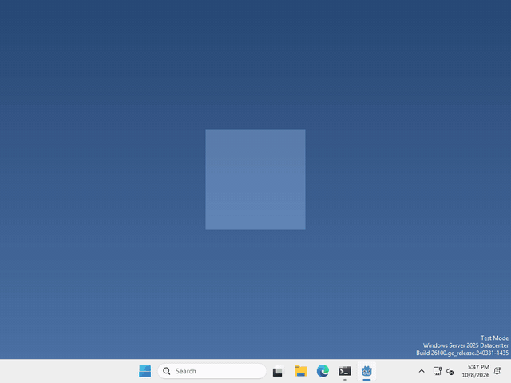

# Let's let clicks through!

Our pet’s window is a 200 by 200 square, even though the pet only fills the middle of it. The empty parts still catch clicks, so they get in the way of whatever is behind them. In Godot, `DisplayServer.window_set_mouse_passthrough()` lets clicks fall through to the desktop.



I made mine let clicks through everywhere except on the pet itself, so I can still pick it up, but what your pet lets through is up to you.

## Say where the pet is

there’s no node to add for this, we just tell Godot which part of the window should still take clicks. That part is a polygon, a list of corner points in the window, where (0, 0) is the top left corner.

whenever you want to set it, run (once when your pet starts is enough)

```gdscript
DisplayServer.window_set_mouse_passthrough(PackedVector2Array([
	Vector2(52, 52), Vector2(148, 52), Vector2(148, 148), Vector2(52, 148)]))
```

Clicks inside those four corners still go to your pet, and clicks anywhere else go to whatever is behind it. Our pet sits in the middle of a 200 by 200 window, so I drew a square around it. Just enough for your pet!

## One catch on Windows

on Windows, anything outside the polygon isn’t drawn at all, so make sure it covers everything you want to see, like a speech bubble. On macOS and Linux it’s still drawn, it just doesn’t take clicks.

To turn it off again, pass an empty array.

That’s it!

## Want more?

You can use any shape, not just a square, and set it on other windows too. It works on Windows, macOS and Linux (X11). It’s all in the [DisplayServer docs](https://docs.godotengine.org/en/stable/classes/class_displayserver.html#class-displayserver-method-window-set-mouse-passthrough).
