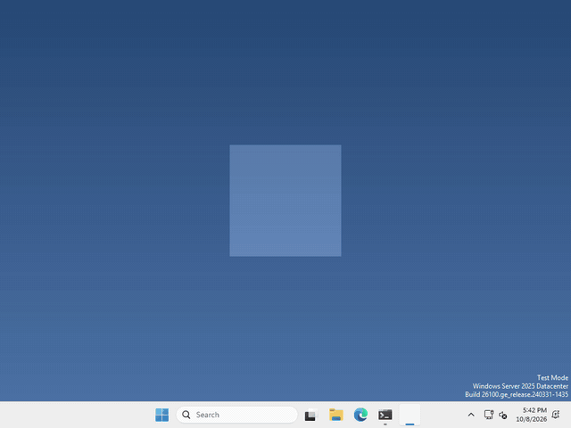

# Let's read what you copied!

Pets are more fun when they notice what you’re up to! In Godot, the clipboard (whatever you last copied) is handled by `DisplayServer`, the same thing your pet already uses to move its window.



I made mine read out whatever you copied every time you drop it, but what your pet does with it, and when, is up to you.

## Read it

there’s no node to add this time, `DisplayServer` is always there. to get the text on the clipboard, run

```gdscript
var copied = DisplayServer.clipboard_get()
```

that’s a normal piece of text, so you can show it in a `Label`, check what’s in it, or do anything else you’d do with text. If nothing has been copied, you get an empty one (`""`).

## Put something on it

your pet can copy things too, run

```gdscript
DisplayServer.clipboard_set("hi!")
```

and the next time anyone pastes, they get "hi!". Only change it when you mean to though, it’s the player’s clipboard, not just your pet’s!

That’s it!

## Want more?

You can check whether anything is on the clipboard, read an image from it, and a lot more. It’s all in the [DisplayServer docs](https://docs.godotengine.org/en/stable/classes/class_displayserver.html).
