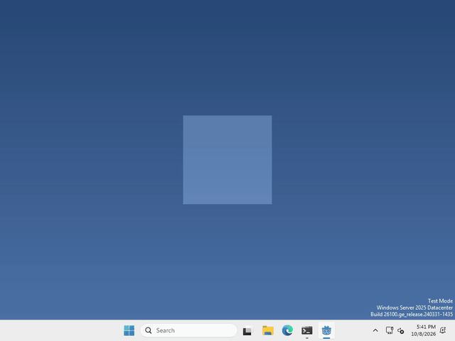

# Let's make your pet tell the time!

Pets are more fun when they know what time it is! In Godot, the `Time` class asks your computer’s clock, so there’s no node to add.



I made mine say good morning, good afternoon or good evening, plus the time, every time you drop it, but what your pet says, and when, is up to you.

## Ask the clock

whenever you want to know the time, run

```gdscript
var time = Time.get_time_dict_from_system()
```

`time` now holds the hour, the minute and the second on your computer right now. `time.hour` goes from 0 to 23, and `time.minute` from 0 to 59.

to show it, put it in some text, like a `Label`:

```gdscript
var time = Time.get_time_dict_from_system()
$Label.text = "%02d:%02d" % [time.hour, time.minute]
```

the `%02d` just keeps the zero, so 9:05 doesn’t turn into 9:5.

## Is it morning?

`time.hour` is just a number, so your pet can check it, and say something different in the morning, in the evening, or in the middle of the night.

```gdscript
var time = Time.get_time_dict_from_system()
if time.hour < 12:
	$Label.text = "good morning!"
```

## What day is it?

the clock knows the day too, it’s in a bigger dictionary:

```gdscript
var day = Time.get_datetime_dict_from_system().weekday
```

`day` is a number, 0 is Sunday and 6 is Saturday.

That’s it!

## Want more?

You can get the date, the time in UTC, a timestamp, and a lot more. It’s all in the [Time docs](https://docs.godotengine.org/en/stable/classes/class_time.html).
