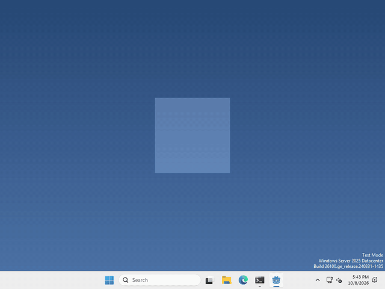

# Let's make our pet react to a double click!

Pets are more fun when they notice how you click them! In Godot, every mouse click arrives as an `InputEventMouseButton`, and it knows whether it was a double click.



I made mine spin when you double-click it, but what your pet does, and whether it cares, is up to you.

## Check for it

A double click isn’t a node, so there’s nothing to add in the Scene panel. We just check for it in code.

put this wherever your pet gets its mouse clicks, like an `_input(event)` function

```gdscript
if event is InputEventMouseButton and event.pressed and event.double_click:
	print("double click!")
```

swap the `print` for whatever you want your pet to do.

`pressed` makes it run once, when the button goes down. The first click of a double click still arrives as a normal click, so your pet gets both.

That’s it!

## Want more?

You can tell which button was clicked, where, and whether keys like Shift were held, and a lot more. It’s all in the [InputEventMouseButton docs](https://docs.godotengine.org/en/stable/classes/class_inputeventmousebutton.html).
