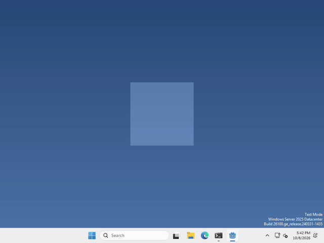
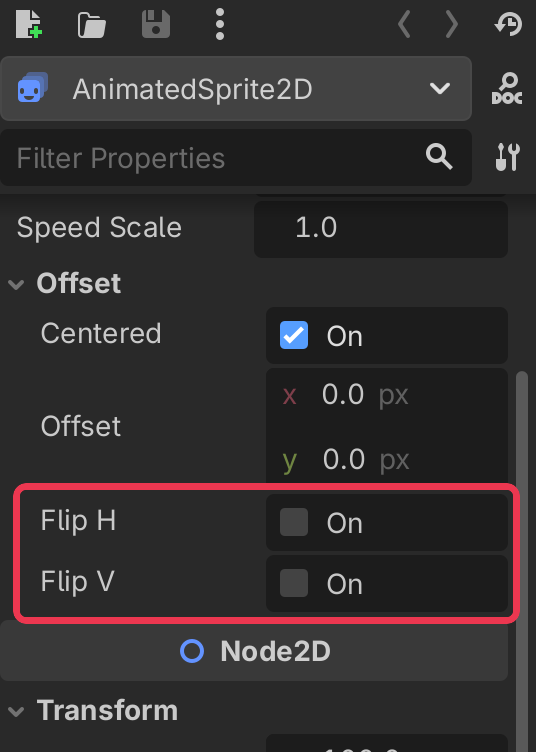

# Let's make your pet turn around!

Pets feel alive when they look at things! In Godot, an `AnimatedSprite2D` can flip itself, so you only have to draw your pet facing one way.



I made mine turn to face the cursor as it moves from one side to the other, but what your pet looks at, and when, is up to you.

## Find the flip

you already have an AnimatedSprite2D in your scene, from when we made the pet.

select it in the Scene panel (top left), then look for Flip H in the inspector on the right. It’s under Offset, so click Offset to open it if you can’t see it.



tick Flip H and your pet turns to face the other way. Flip V does the same, but upside down.

## Flip it from code

whenever you want your pet to turn around, run

```gdscript
$AnimatedSprite2D.flip_h = true
```

and set it to `false` to turn it back.

## Face the cursor

to make your pet look at the cursor, we can set `flip_h` to whether the cursor is to the left of the pet. Our window is 200 pixels wide, so the middle of our pet is 100 pixels in.

```gdscript
$AnimatedSprite2D.flip_h = DisplayServer.mouse_get_position().x < DisplayServer.window_get_position().x + 100
```

I run that every frame, in `_physics_process`, so the pet turns the moment the cursor crosses over it.

That’s it!

## Want more?

You can flip it up and down with `flip_v`, move it with Offset, and a lot more. It’s all in the [AnimatedSprite2D docs](https://docs.godotengine.org/en/stable/classes/class_animatedsprite2d.html).
