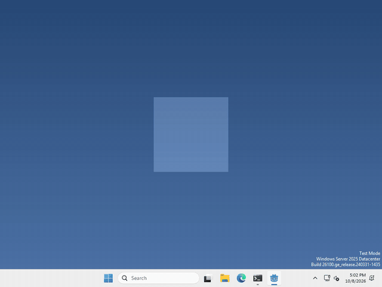

# Let’s drop it on the taskbar!

Pets are more fun when they know where the desktop ends! In Godot, you can ask the screen where the usable part stops with `DisplayServer.screen_get_usable_rect()`.



I made mine fall when you drop it, and land on top of the taskbar, but what your pet does with the edge of the screen is up to you.

## The whole screen, and the usable part

`DisplayServer.screen_get_size()` gives you the size of the whole screen, with the taskbar underneath everything.

`DisplayServer.screen_get_usable_rect()` gives you just the part that isn’t covered up, as a rectangle with a position and a size. On Windows that’s everything above the taskbar (on macOS it leaves out the Dock and the menu bar).

## Find the top of the taskbar

the bottom of that rectangle is where the taskbar starts, so to get its y position, run

```gdscript
var usable = DisplayServer.screen_get_usable_rect()
var taskbar_y = usable.end.y
```

Windows are placed by their top left corner, so to stand your pet on the taskbar, set its window’s y to `taskbar_y` minus the window’s height. If there’s empty space under your pet’s feet, take that away too.

That’s it!

## Want more?

If the taskbar is on the side or the top of the screen, `usable.position` and `usable.size` change to match. It’s all in the [DisplayServer docs](https://docs.godotengine.org/en/stable/classes/class_displayserver.html).
