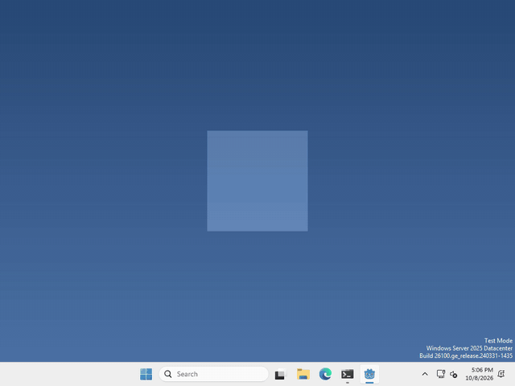

# Let's follow the mouse!

Your pet can know where the mouse is anywhere on the screen, not just when it’s over the pet. In Godot, the `DisplayServer` tells us.



I made mine walk toward the cursor, but what your pet does with the mouse is up to you.

## Where’s the mouse?

`DisplayServer` isn’t a node, so there’s nothing to add in the Scene panel. We just ask it in code.

whenever you want to know where the mouse is, run

```gdscript
var mouse = DisplayServer.mouse_get_position()
```

That’s the mouse’s position on your whole screen, in pixels, with (0, 0) in the top left corner of the screen. It doesn’t matter where your pet’s window is.

## Where’s your pet?

your pet lives in a window, and the window has a position on the screen too, in the same pixels.

```gdscript
var window = DisplayServer.window_get_position()
```

That’s the top left corner of the window. Since ours is 200 by 200, add (100, 100) to get the pet’s middle.

if you want the mouse inside your window instead, take one from the other: `mouse - window`.

## Which way is the mouse?

Take where the pet is away from where the mouse is, and you get an arrow from one to the other. Make it 1 long with `normalized()`, and now you have a direction!

```gdscript
var pet = Vector2(DisplayServer.window_get_position()) + Vector2(100, 100)
var direction = (Vector2(DisplayServer.mouse_get_position()) - pet).normalized()
```

we wrap the positions in `Vector2(...)` because they come out as `Vector2i`, which can’t be normalized.

That’s it! Move your pet along that direction and it heads for the mouse.

## Want more?

You can move the mouse, find the size of the screen, and a lot more. It’s all in the [DisplayServer docs](https://docs.godotengine.org/en/stable/classes/class_displayserver.html).
