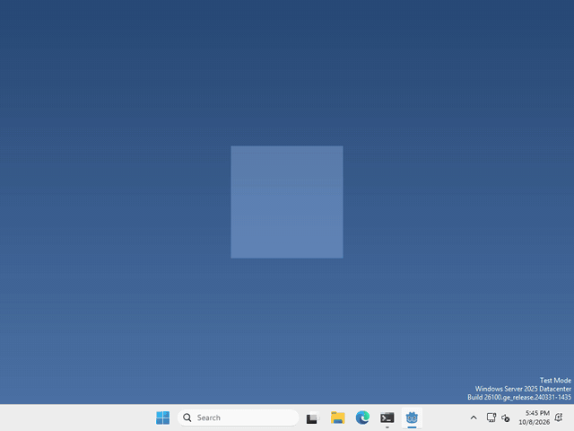
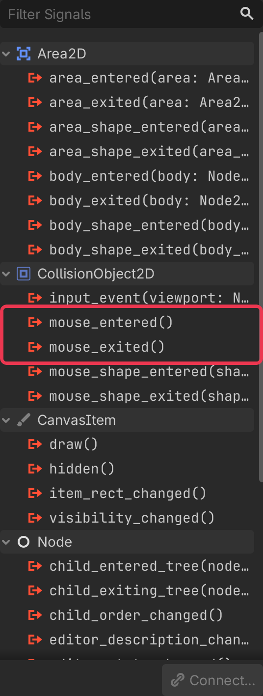

# Let's make your pet notice the mouse!

Pets are more fun when they react to you! In Godot, an `Area2D` tells you when the mouse moves over it, and when it leaves.



I made mine grow a little while the cursor is over it, but what your pet does when it notices the mouse is up to you.

## Use your Area2D

your pet already has an Area2D from when we made the scene, with a CollisionShape2D under it. That shape is the part of your pet that notices the mouse. Just enough for your pet!

select your Area2D, then click the Signals tab next to the Inspector (top right).

you’ll see a list of signals, these are things the node can tell you about. The two we want are `mouse_entered()` and `mouse_exited()`.



## Connect them

in your script’s `_ready()`, connect each signal to what you want to happen. I made mine change the size of my sprite:

```gdscript
$Area2D.mouse_entered.connect(func(): $AnimatedSprite2D.scale = Vector2(1.3, 1.3))
$Area2D.mouse_exited.connect(func(): $AnimatedSprite2D.scale = Vector2(1, 1))
```

whatever you put after `func():` runs when the mouse comes in, and when it leaves.

That’s it!

## Want more?

You can also tell when the mouse moves from one shape to another, and a lot more. It’s all in the [CollisionObject2D docs](https://docs.godotengine.org/en/stable/classes/class_collisionobject2d.html), which Area2D builds on, and the [Area2D docs](https://docs.godotengine.org/en/stable/classes/class_area2d.html).
