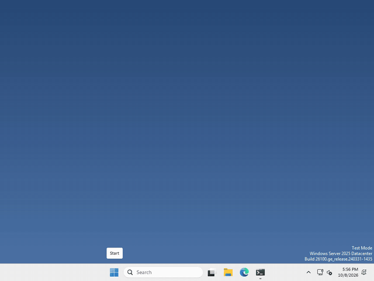
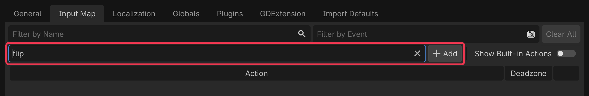
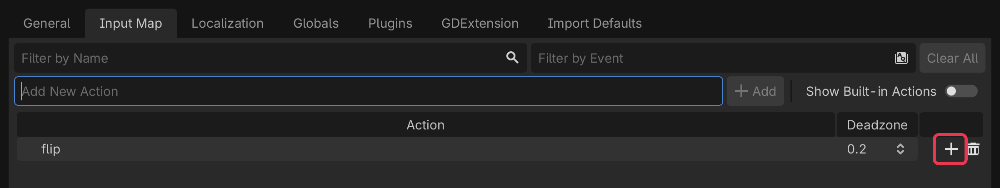
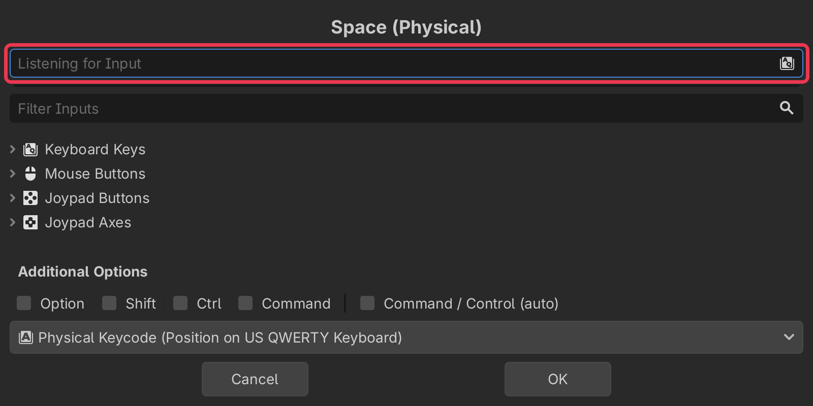

# Let's give your pet a keyboard shortcut!

Pets are more fun when you can tell them what to do! In Godot, a key press is given a name in the Input Map, and your code asks if that name was pressed.



I made mine do a flip every time you press Space, but what your pet does, and which key does it, is up to you.

## Add an action

An action is just a name for something you can do, like "flip". Click Project > Project Settings…, then open the Input Map tab at the top.

type your action’s name into the Add New Action box, then click Add.



## Give it a key

your new action shows up in the list, click the + at the end of its row.



a window will pop up that says Listening for Input, now just press the key you want, like Space. Then click OK.



One thing to know: your key only works while your pet’s window has focus, so click your pet first when you try it. Godot can’t hear keys while another app is in front.

## Check for it from code

to find out if the key was pressed, ask for it by name. Put this in a `_process` function, so it checks every frame

```gdscript
if Input.is_action_just_pressed("flip"):
	$AnimatedSprite2D.flip_v = !$AnimatedSprite2D.flip_v
```

that turns your pet upside down, and a second press turns it back. Mine spins all the way round instead, but what it does is up to you.

That’s it!

## Want more?

You can add more than one key to an action, use the mouse or a gamepad, check if a key is being held down, and a lot more. It’s all in the [Input Map docs](https://docs.godotengine.org/en/stable/tutorials/inputs/input_examples.html) and the [Input class docs](https://docs.godotengine.org/en/stable/classes/class_input.html).
