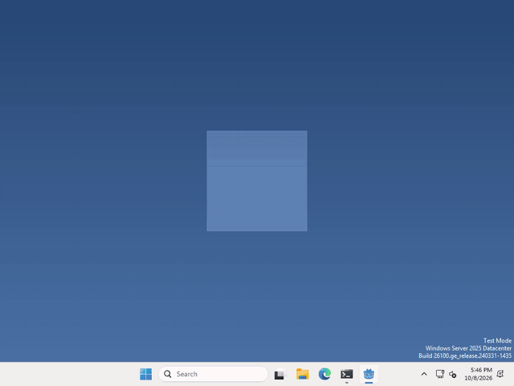

# Let's open a website from your pet!

Your pet can open a website too! In Godot, there is no node for this, it’s one line of code: `OS.shell_open()`.



I made mine open [hackclub.com](https://hackclub.com) when you click it, but which website, and when it opens, is up to you.

## Open it

whenever you want your pet to open a website, run

```gdscript
OS.shell_open("https://hackclub.com")
```

it opens in the computer’s default browser, so your pet doesn’t need any extra nodes or settings. Just enough for your pet!

## Files and folders too

`OS.shell_open()` asks the computer to open whatever you give it with the right program. So a website opens in your browser, and a folder’s path opens it in the file explorer.

That’s it!

## Want more?

It’s a good one to use carefully, a pet that opens a website every few seconds gets annoying fast. Everything else is in the [OS docs](https://docs.godotengine.org/en/stable/classes/class_os.html#class-os-method-shell-open).
