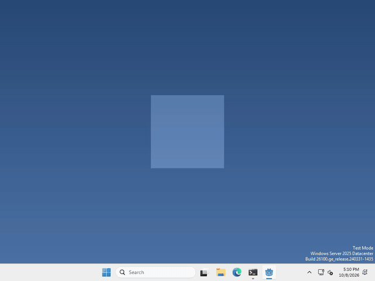
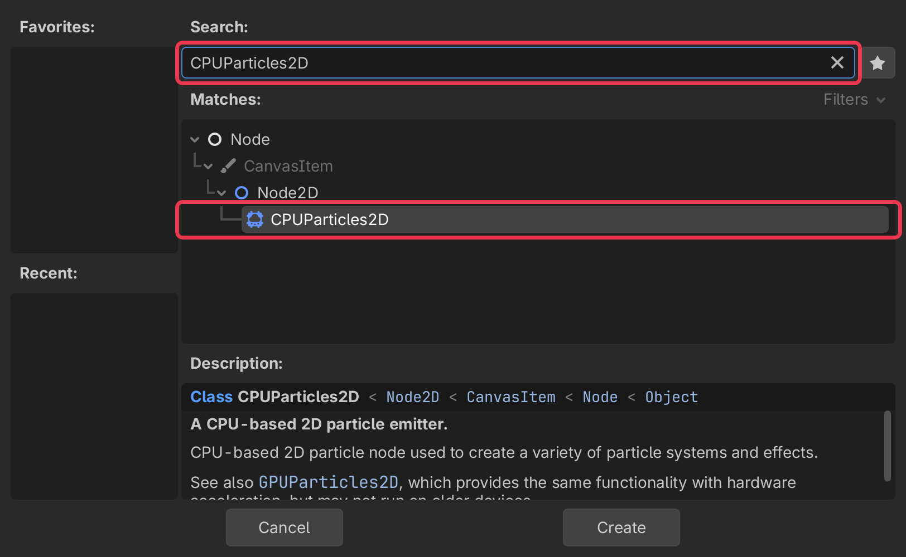
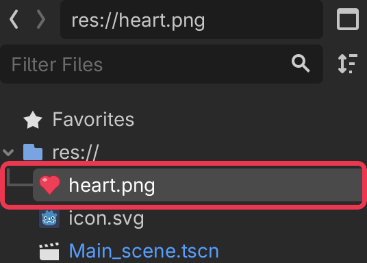
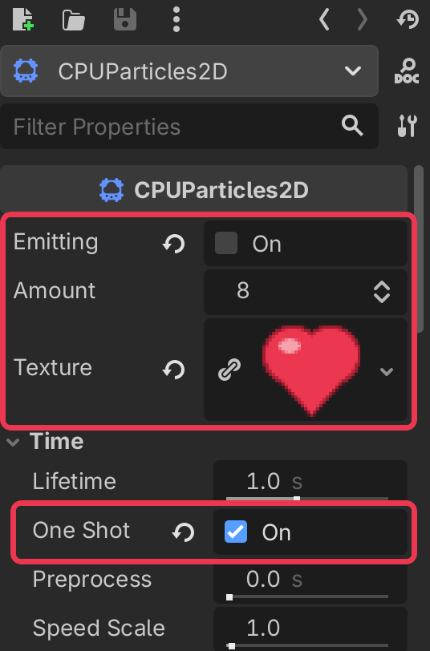

# Let's make some hearts!

Pets are more fun when they shower you with love! In Godot, little bursts like that are made by a `CPUParticles2D` node.



I made mine burst into hearts every time you drop it, but what your pet gives off, and when, is up to you.

We’re using CPUParticles2D instead of its twin GPUParticles2D because all of its settings sit right in the inspector, with no extra material to make first.

## Add a CPUParticles2D

In the Scene panel (top left), click + to add a new node.

type CPUParticles2D into the search bar, select it, and click Create.



particles come out of the node’s position, so move it to where you want them to start.

## Give it a picture

By default the particles are plain little squares, so let’s give them a picture!

import an image into your project’s FileSystem, you can do this by just dragging it in, the same way you did your sprites.



then select your CPUParticles2D, and drag the image onto Texture in the inspector on the right.

Don’t have one? Draw a tiny one yourself, or find some on [kenney.nl](https://kenney.nl/assets) as long as the license allows for it.

## Set it up

Still in the inspector, there are a few settings to look at.

Amount is how many particles you get, I’m using 8.

turn One Shot on (it’s under Time), so you get one burst instead of a never ending fountain.

Emitting is on by default, so you’ll see your particles the moment the game starts. I turned it off so mine waits for the drop.



Your pet’s window is only 200 by 200, so anything that flies outside it gets cut off! Mine stay close to the pet.

## Make it go

whenever you want your pet to give off its particles, run

```gdscript
$CPUParticles2D.restart()
```

or if you like, you can set `emitting` to `true` instead, but it won’t start a new burst until the last one has finished.

```gdscript
$CPUParticles2D.emitting = true
```

That’s it!

## Want more?

You can change which way they fly, how fast, how long they last, their colour and size, and a lot more. It’s all in the [CPUParticles2D docs](https://docs.godotengine.org/en/stable/classes/class_cpuparticles2d.html).
