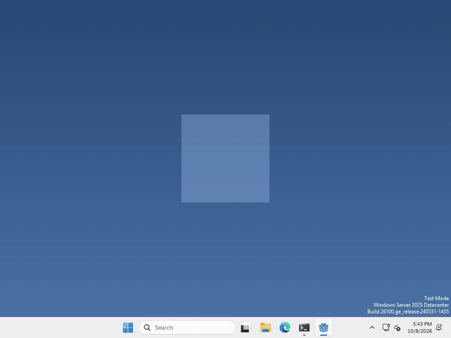

# Let's make your pet unpredictable!

Pets are more fun when they don’t do the same thing every time! In Godot, you can get a random number or a random pick with a few built-in functions.



I made mine say a random line from a list every time you drop it, but what your pet does at random, and when, is up to you.

## No node needed

Unlike most things in Godot, there’s nothing to add to the Scene panel here. These are functions that work anywhere in your code, so just type them into your script.

## A random number

to get a random whole number, run

```gdscript
var roll = randi_range(1, 6)
```

that gives a number from 1 to 6, and both ends can come up. For a number with a decimal point, use `randf_range`.

```gdscript
var seconds = randf_range(1.0, 3.0)
```

## A random chance

to do something only some of the time, run

```gdscript
if randf() < 0.3:
	print("this happens 30% of the time")
```

`randf()` gives a random number from 0 to 1, so `< 0.3` is true about 3 times out of 10. Make the number smaller for rarer, bigger for more often.

## A random pick

to pick one thing out of a list, put your things in an array and run

```gdscript
var line = ["hi!", "hello!", "yay!"].pick_random()
```

That’s it!

## Want more?

You can seed the random numbers, shuffle an array, pick by weight, and a lot more. It’s all in the [Godot docs on random numbers](https://docs.godotengine.org/en/stable/tutorials/math/random_number_generation.html), and the functions are listed in the [@GlobalScope docs](https://docs.godotengine.org/en/stable/classes/class_@globalscope.html).
