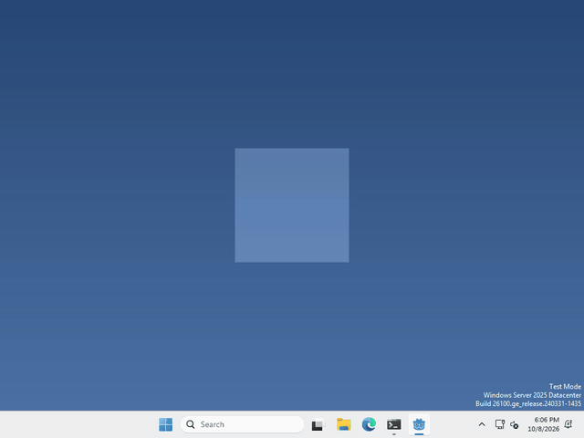
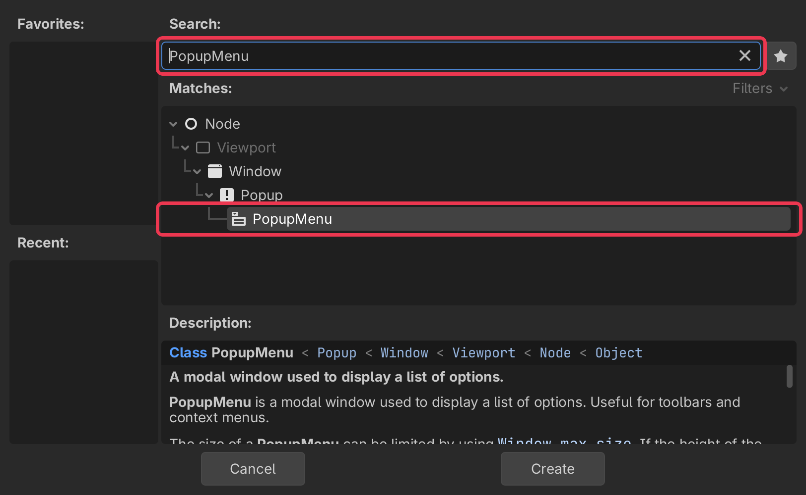

# Let's give your pet a right-click menu!

Pets are more fun when you can tell them what to do! In Godot, a menu is a `PopupMenu` node.



I made mine have Sit and Quit, but what your pet’s menu has, and what each item does, is up to you.

## Add a PopupMenu

In the Scene panel (top left), click + to add a new node.

type PopupMenu into the search bar, select it, and click Create.



## Give it some items

a PopupMenu starts out empty and hidden. to add an item, run

```gdscript
$PopupMenu.add_item("Sit", 0)
```

the text is what shows in the menu, and the number is the item’s id, you’ll use it in a moment. Add as many as you like.

## Open it on a right-click

the same way you check for a left click, check for `MOUSE_BUTTON_RIGHT`. then open the menu where the mouse is

```gdscript
$PopupMenu.popup_on_parent(Rect2i(Vector2i(event.position), Vector2i.ZERO))
```

`event.position` is where you clicked inside your pet’s window, and `popup_on_parent` opens the menu relative to that window. Our window is only 200 pixels wide, but that’s fine, the menu is small. Godot keeps it in view if you click near the edge.

## Find out what was picked

whenever an item is picked, the menu sends out `id_pressed` with that item’s id. connect it to a function

```gdscript
$PopupMenu.id_pressed.connect(_on_menu_pressed)
```

and in the function, check which id you got

```gdscript
func _on_menu_pressed(id):
	if id == 0:
		print("sit!")
```

That’s it!

## Want more?

You can add separators and checkboxes, make submenus, turn items off, and a lot more. It’s all in the [PopupMenu docs](https://docs.godotengine.org/en/stable/classes/class_popupmenu.html).
