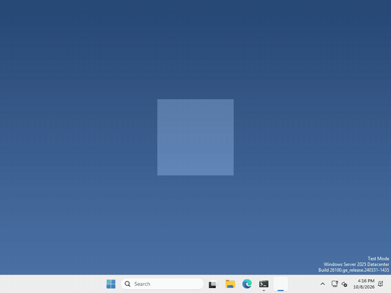

# Let's make our pet remember!

Pets are better when they remember you! In Godot, values are saved to a file, and loaded back, with a `ConfigFile`.



I made mine remember where you left it, so it comes back at the same spot every time you open it, but what your pet remembers is up to you.

## Make a ConfigFile

A ConfigFile is a small text file of named values, and it isn’t a node, so there’s nothing to add in the Scene panel. We just make one in code.

## Save a value

to save something, put it in the ConfigFile with a section name and a key, then save it to a path, like this

```gdscript
var config = ConfigFile.new()
config.set_value("pet", "name", "Bob")
config.save("user://pet.cfg")
```

`"pet"` is the section and `"name"` is the key, you can save as many values as you want, each with its own key.

## Load it back

whenever you want your pet to remember, load the same file and ask for the value by its section and key

```gdscript
var config = ConfigFile.new()
if config.load("user://pet.cfg") == OK:
	var pet_name = config.get_value("pet", "name")
```

The first time your pet runs there’s no file yet, so `load` doesn’t return `OK`. That’s what the `if` is for!

## Where does it go?

`user://` is a folder Godot gives your game for its own files, so it’s the place to save. Not `res://`, that can’t be written to once you export your pet.

Want to see the file? In Godot, click **Project > Open User Data Folder**, and `pet.cfg` is plain text.

That’s it!

## Want more?

You can save positions, numbers, lists, and a lot more, and even remove values or whole sections. It’s all in the [ConfigFile docs](https://docs.godotengine.org/en/stable/classes/class_configfile.html), and [where `user://` is on each computer](https://docs.godotengine.org/en/stable/tutorials/io/data_paths.html).
