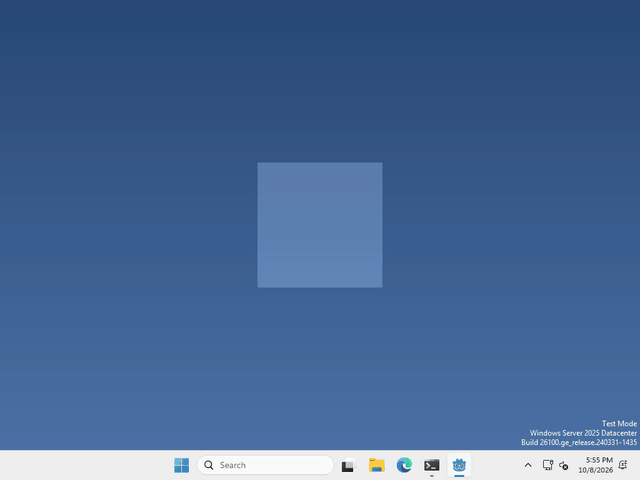

# Let's use the scroll wheel!

Pets are more fun when you can poke at them in more ways than one! In Godot, the scroll wheel is a mouse button, so it arrives as an `InputEventMouseButton`.



I made mine grow when you scroll up over it and shrink when you scroll down, but what your pet does with the wheel is up to you.

## Listen for it

there’s nothing to add this time! Your pet’s Area2D already sends every mouse event it gets over its `input_event` signal, the same one we used to pick the pet up.

the wheel shows up there with a `button_index` of `MOUSE_BUTTON_WHEEL_UP` or `MOUSE_BUTTON_WHEEL_DOWN`.

## Check for it

in the function that signal calls, the mouse event is called `event`. Check it like this

```gdscript
if event is InputEventMouseButton and event.pressed and event.button_index == MOUSE_BUTTON_WHEEL_UP:
	print("scrolled up!")
```

the wheel sends a press and a release for every notch, so checking `event.pressed` makes sure it only counts once.

Yours will only hear the wheel while the cursor is over your pet. If you want it to hear the wheel anywhere over your pet’s window, the same check works inside `_input(event)`.

Use `MOUSE_BUTTON_WHEEL_DOWN` for scrolling the other way.

That’s it!

## Want more?

You can read how far a scroll went, listen for sideways scrolling, and a lot more. It’s all in the [InputEventMouseButton docs](https://docs.godotengine.org/en/stable/classes/class_inputeventmousebutton.html).
