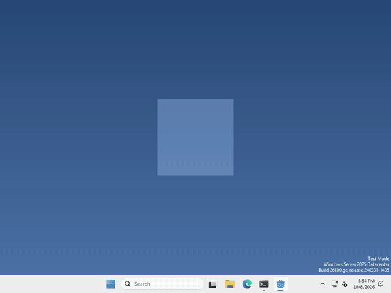
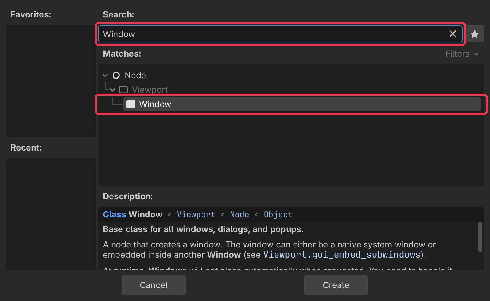
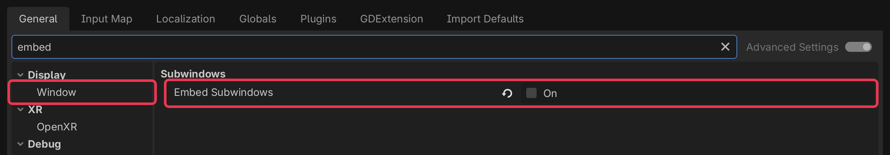
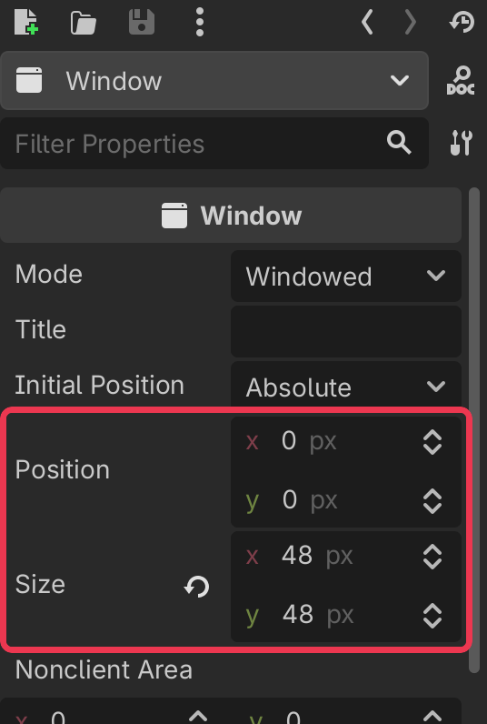
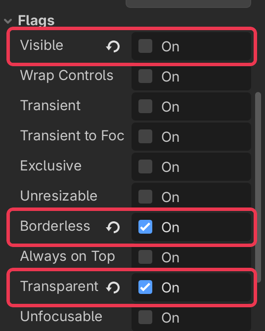
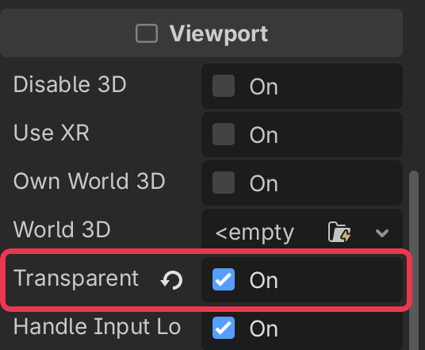

# Let's give your pet a second window!

Pets are more fun when they can drop things! In Godot, an extra window is a `Window` node.



I made mine drop a heart every time you drop it, and the heart stays put while the pet walks away, but what your pet does with its second window is up to you.

## Add a Window

In the Scene panel (top left), click + to add a new node.

type Window into the search bar, select it, and click Create.



anything you want inside the window goes under it in the Scene panel, like a Sprite2D for a picture.

## Let it leave your pet’s window

Right now a Window is drawn inside the window it’s in, so anything past your pet’s 200 pixel edge gets cut off. to change that we need to adjust the project’s settings.

Click Project > Project Settings…

search for Embed Subwindows, it’s under Display > Window, and turn it off.



## Size and position

select your Window, and set Size in the inspector on the right. Position is where it sits on your screen, in pixels, counting from the top left corner. Now that we turned Embed Subwindows off it’s a spot on the screen, not a spot in your pet’s window.



you can set it from code too, run

```gdscript
$Window.position = Vector2i(400, 300)
```

## No border, no background

open Flags in the inspector, and turn on Borderless and Transparent.



then scroll down to Viewport and turn on Transparent BG too.



Transparent only works because your pet’s project already has Per Pixel Transparency on, you turned it on when you made the pet see through.

## Show it

a Window starts out visible. If you don’t want it yet, turn off Visible, it’s at the top of Flags, then whenever you want it to appear, run

```gdscript
$Window.show()
```

and `hide()` makes it go away again.

That’s it!

## Want more?

You can change the title, keep the window on top of everything, stop it from taking focus, let clicks pass through it, and a lot more. It’s all in the [Window docs](https://docs.godotengine.org/en/stable/classes/class_window.html).
