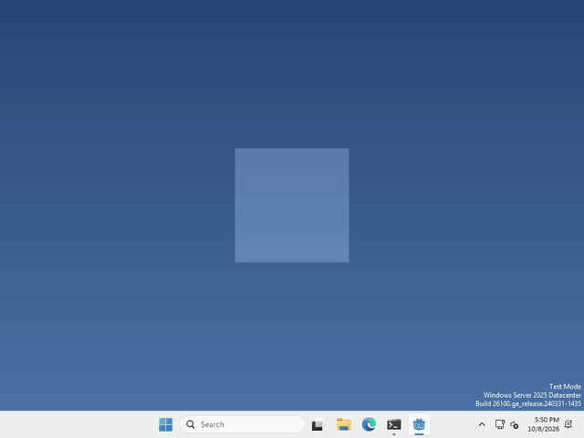
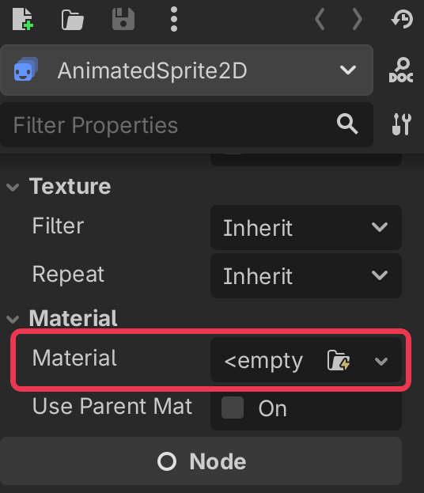
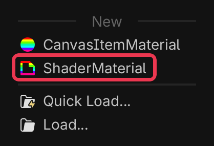
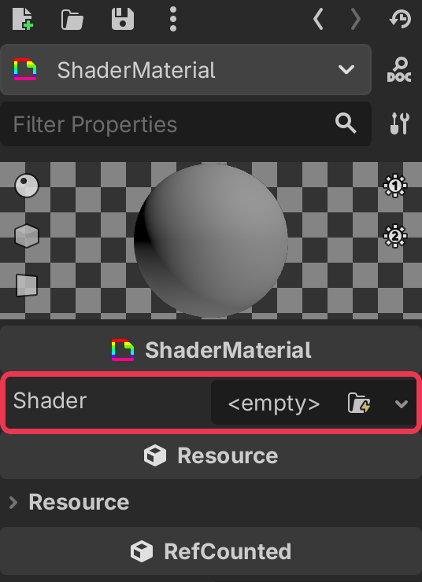

# Let's make our pet flash!

Pets are more fun when they can change how they look! In Godot, a `ShaderMaterial` runs a tiny program called a shader on every pixel of a node, so you can tint it, flash it, wobble it and more.



I made mine flash white every time you click it, but what your pet does to its pixels, and when, is up to you.

## Add a ShaderMaterial

A material isn’t a node, it’s a property of one. Select your AnimatedSprite2D, and scroll down in the inspector on the right until you find Material.



click the box, and pick ShaderMaterial from the list.



## Give it a shader

click your new ShaderMaterial to open it, then click the Shader box, pick New Shader…, and click Create.



the Shader Editor opens at the bottom. Delete what’s in there and paste this in

```glsl
shader_type canvas_item;

uniform float flash : hint_range(0.0, 1.0) = 0.0;

void fragment() {
	COLOR.rgb = mix(COLOR.rgb, vec3(1.0), flash);
}
```

`fragment()` runs for every pixel of your pet, and `COLOR` is that pixel’s colour. This blends it towards white by `flash`, and keeps the see-through parts see-through. Just enough for a flash!

A `uniform` is a variable that your code can set from outside the shader. Click your ShaderMaterial again and you’ll find Flash under Shader Parameters, try dragging it! It works with the Compatibility renderer too.

## Change it from code

whenever you want your pet to flash, run

```gdscript
$AnimatedSprite2D.material.set_shader_parameter("flash", 1.0)
```

and set it back to `0.0` to go back to normal.

That’s it!

## Want more?

You can change colours, make the pet wobble, draw an outline, fade it out, and a lot more. It’s all in the [ShaderMaterial docs](https://docs.godotengine.org/en/stable/classes/class_shadermaterial.html) and the [shading language docs](https://docs.godotengine.org/en/stable/tutorials/shaders/shader_reference/canvas_item_shader.html).
