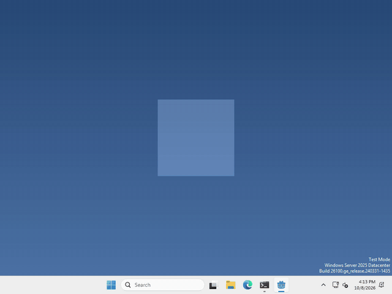
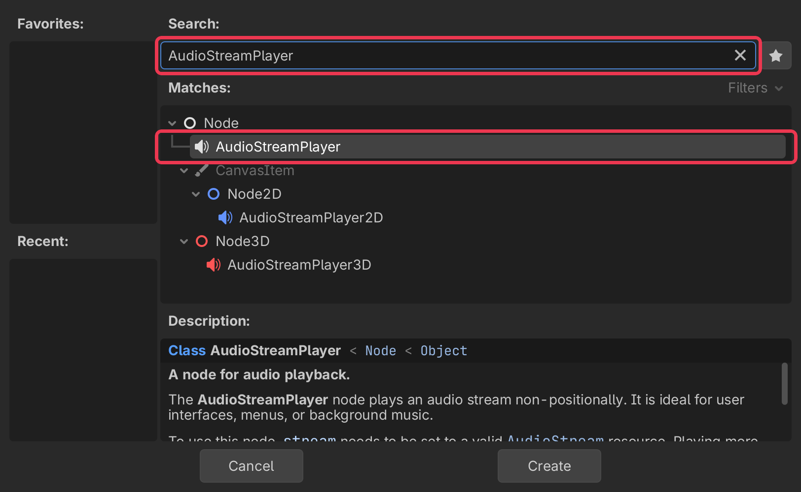
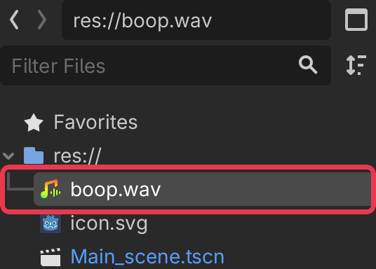
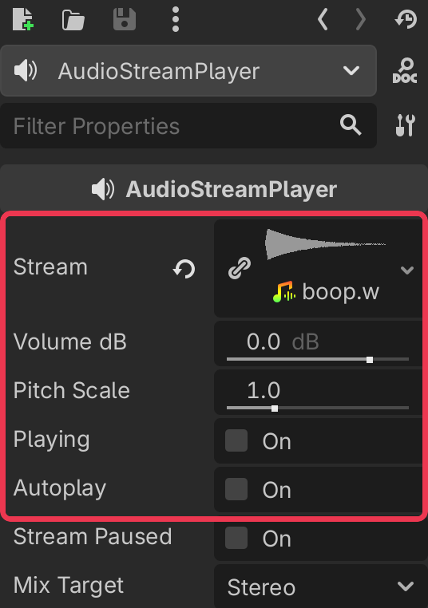

# Let's make some noise!

Pets are more fun when they make sounds! In Godot, sounds are played by an `AudioStreamPlayer` node.



I made mine go boop every time you drop it ([listen here](images/result.mp4)), but what your pet plays, and when, is up to you.

## Add an AudioStreamPlayer

In the Scene panel (top left), click + to add a new node.

type AudioStreamPlayer into the search bar, select it, and click Create.



## Give it a sound

import your sound into your project’s FileSystem, you can do this by just dragging it in, the same way you did your sprites. `.wav`, `.ogg` and `.mp3` all work.



then select your AudioStreamPlayer, and drag your sound onto Stream in the inspector on the right.



Don’t have a sound? You can make retro ones at [sfxr.me](https://sfxr.me), record your own, or find some on [kenney.nl](https://kenney.nl/assets) or [freesound.org](https://freesound.org) as long as the license allows for it.

## Play it

whenever you want your pet to make its sound, run

```gdscript
$AudioStreamPlayer.play()
```

That’s it!

## Want more?

You can change the volume, change the pitch, loop it, stop it, and a lot more. It’s all in the [AudioStreamPlayer docs](https://docs.godotengine.org/en/stable/classes/class_audiostreamplayer.html).
