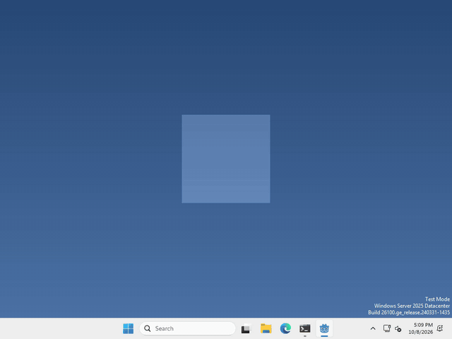
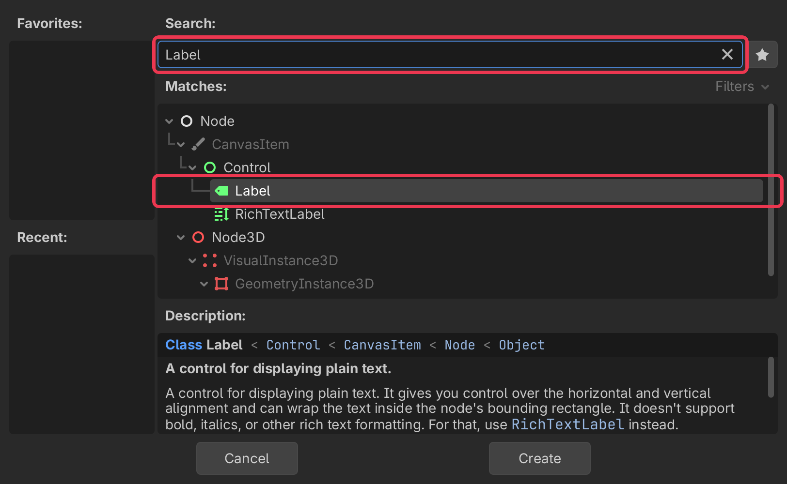
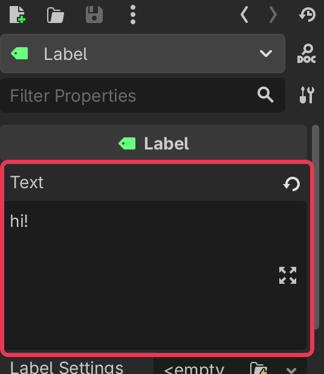
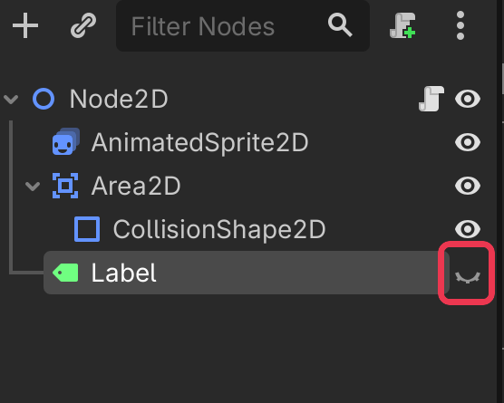

# Let's give your pet something to say!

Pets are more fun when they can talk! In Godot, text is shown by a `Label` node.



I made mine say hi every time you drop it, but what your pet says, and when, is up to you.

## Add a Label

In the Scene panel (top left), click + to add a new node.

type Label into the search bar, select it, and click Create.



## Give it some text

select your Label, and type what you want it to say into Text in the inspector on the right.



then drag the Label in the 2D view to sit above your pet. Our window is only 200 pixels wide, so anything past its edge gets cut off.

## Change it from code

whenever you want your pet to say something else, run

```gdscript
$Label.text = "hi!"
```

## Show it and hide it

a Label can be hidden, the eye next to it in the Scene panel (top left) does that while you’re building.



to show it from code, run

```gdscript
$Label.visible = true
```

and set it to `false` to hide it again.

That’s it!

## Want more?

You can change the font and its size, change the colour, wrap long text onto more lines, and a lot more. It’s all in the [Label docs](https://docs.godotengine.org/en/stable/classes/class_label.html).
