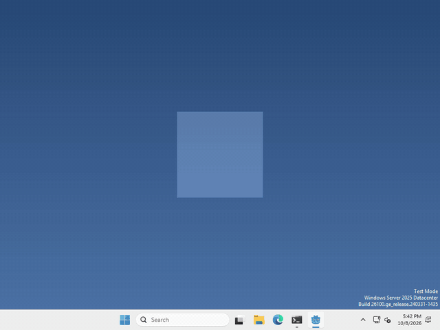

# Let's give your pet some moods!

Pets are more fun when they do different things at different times! In Godot, we can keep track of what our pet is doing with an `enum` and a `match`. These are part of GDScript, so there is no node to add this time.



I made mine walk and sleep, and a click switches between the two, but which states your pet has, and what flips them, is up to you.

## Name the states

at the top of your pet’s script, write

```gdscript
enum State { WALK, SLEEP }
var state = State.WALK
```

An `enum` is just a list of names, so we can write `State.SLEEP` instead of remembering that sleep is the number 1. `state` is where we keep which one our pet is in right now.

## Do something for each one

a `match` looks at `state` and runs only the part that fits.

```gdscript
match state:
	State.WALK:
		$Label.text = "walking!"
	State.SLEEP:
		$Label.text = "zzz..."
```

I put mine in a little function that I call whenever the state changes. To change it, run

```gdscript
state = State.SLEEP
```

That’s it!

## Want more?

You can add as many states as you like, and `match` can do a lot more than names. It’s all in the [GDScript reference](https://docs.godotengine.org/en/stable/tutorials/scripting/gdscript/gdscript_basics.html#match).
