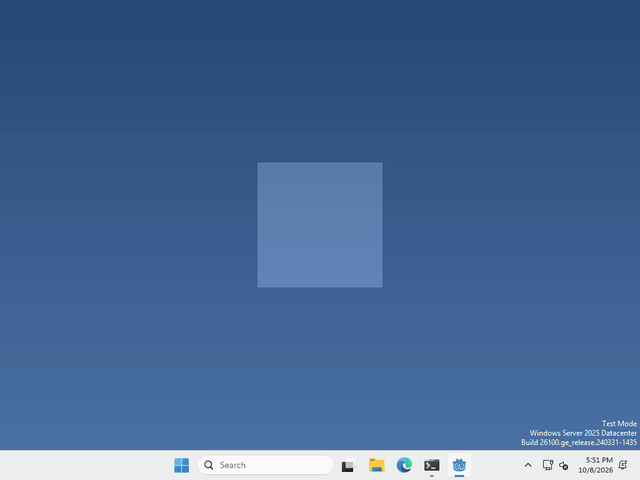
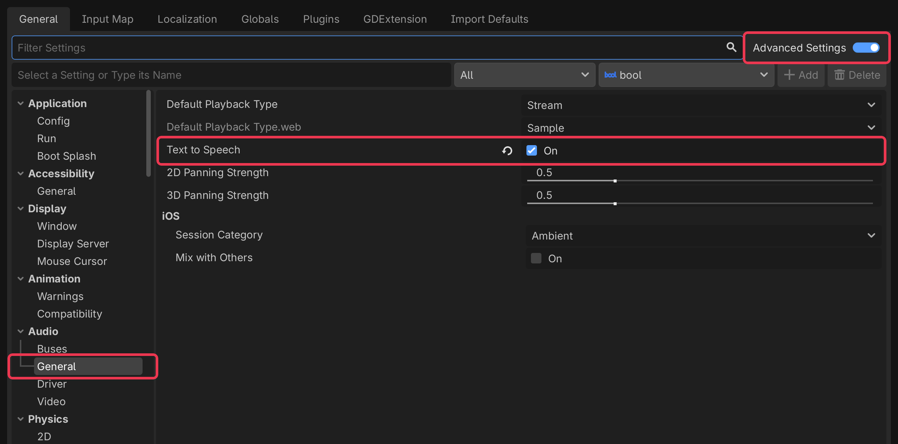

# Let's make your pet talk!

Pets are more fun when they can talk out loud! In Godot, your computer’s own voice is used through `DisplayServer.tts_speak()`, there’s no node to add.



I made mine say hello every time you drop it (a GIF can’t play sound, so the "hello!" is there to show what it said), but what your pet says, and when, is up to you.

## Turn it on

text to speech is off by default, and Godot only switches it on the first time you use it, so let’s switch it on from the start.

Click Project > Project Settings… (top left), then switch on Advanced Settings (top right).

then click Audio > General on the left, and tick Text to Speech.



## Pick a voice

every computer has its own voices, so we ask for the English ones and take the first, run

```gdscript
var voices = DisplayServer.tts_get_voices_for_language("en")
```

If your computer has no English voice, that list is empty, so it’s worth checking `voices.is_empty()` before you use it.

## Say something

whenever you want your pet to say something, run

```gdscript
DisplayServer.tts_speak("hello!", voices[0])
```

That’s it!

## Want more?

You can change the volume, the pitch and the speed, stop it, find out when it’s finished, and a lot more. It’s all in the [DisplayServer docs](https://docs.godotengine.org/en/stable/classes/class_displayserver.html#class-displayserver-method-tts-speak).
