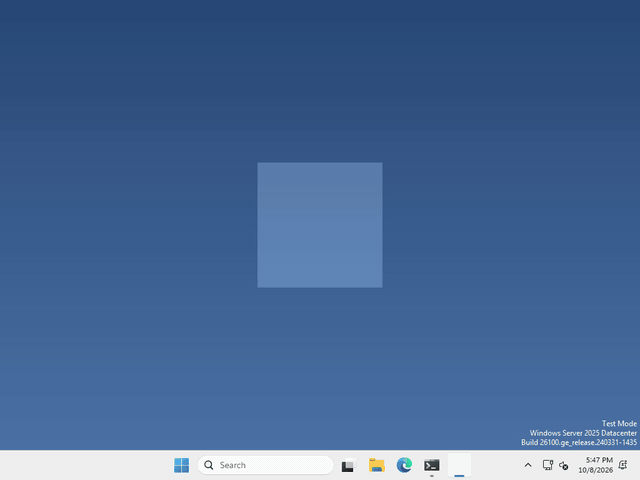

# Let's throw the pet!

Pets are more fun when you can fling them! There’s no node for this, it’s just a little maths with where the mouse was a moment ago.



I made mine slide away and slowly stop when you let go, but how far your pet flies, and what it does when it lands, is up to you.

## How fast is the mouse?

Speed is just how far something moved, divided by how long it took. Every frame, Godot tells us how long the last frame took in `delta`, and we can ask where the mouse is with `DisplayServer`.

keep the mouse’s position from last frame in a variable at the top of your script, like `var last_mouse = Vector2()`, and the same for `var velocity = Vector2()`, so it’s still there after you let go.

then, while the pet is being dragged, run

```gdscript
var mouse = Vector2(DisplayServer.mouse_get_position())
velocity = (mouse - last_mouse) / delta
last_mouse = mouse
```

`velocity` is a `Vector2`, so it knows which way the mouse went as well as how fast. It’s in pixels per second.

when you let go, the last `velocity` you measured is how hard the pet was thrown!

## Keep it moving, but slower

after the drop, move your pet by `velocity * delta` every frame, the same way it already walks.

if that was all, it would fly off forever. To slow it down, pull `velocity` a little closer to zero each frame with `lerp`.

```gdscript
velocity = velocity.lerp(Vector2.ZERO, 2 * delta)
```

the bigger the 2, the faster it stops. Once `velocity` is tiny, set it to zero and let your pet go back to what it was doing.

That’s it!

## Want more?

`move_toward` can slow it down at a steady rate instead, and `Vector2` can do a lot more. It’s all in the [Vector2 docs](https://docs.godotengine.org/en/stable/classes/class_vector2.html), and `DisplayServer` is in the [DisplayServer docs](https://docs.godotengine.org/en/stable/classes/class_displayserver.html).
