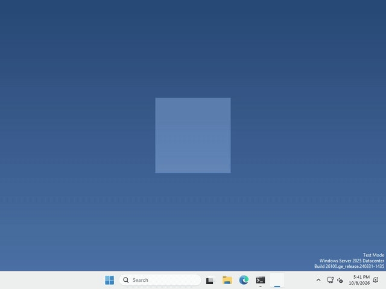
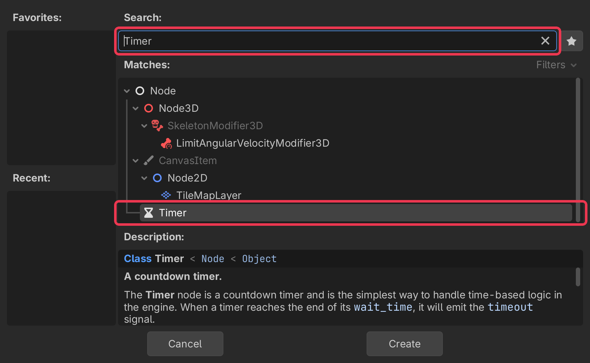
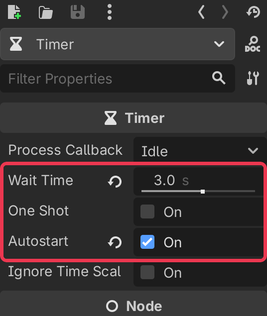

# Let's make your pet do things on its own!

Pets are more fun when they act without being poked! In Godot, waiting is done by a `Timer` node.



I made mine say something every 3 seconds, but what your pet does, and how often, is up to you.

## Add a Timer

In the Scene panel (top left), click + to add a new node.

type Timer into the search bar, select it, and click Create.



## Set how long it waits

select your Timer, and set Wait Time in the inspector on the right, it’s in seconds.

then turn on Autostart so it starts counting as soon as your pet appears. Leave One Shot off and it will count again and again, turn it on and it only goes off once.



## Do something when it goes off

every time the Timer runs out it sends out a signal called `timeout`. Connect it to a function of yours and that function runs, in `_ready()` run

```gdscript
$Timer.timeout.connect(say_something)
```

Just a one-off wait, with no node? `await get_tree().create_timer(2.0).timeout` pauses your function for 2 seconds.

That’s it!

## Want more?

You can start and stop it from code, change how long it waits, and a lot more. It’s all in the [Timer docs](https://docs.godotengine.org/en/stable/classes/class_timer.html).
